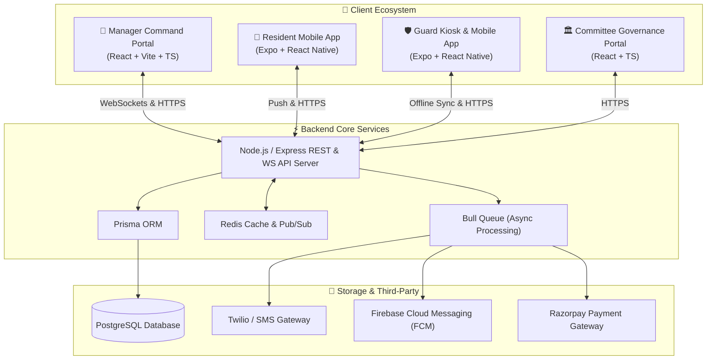
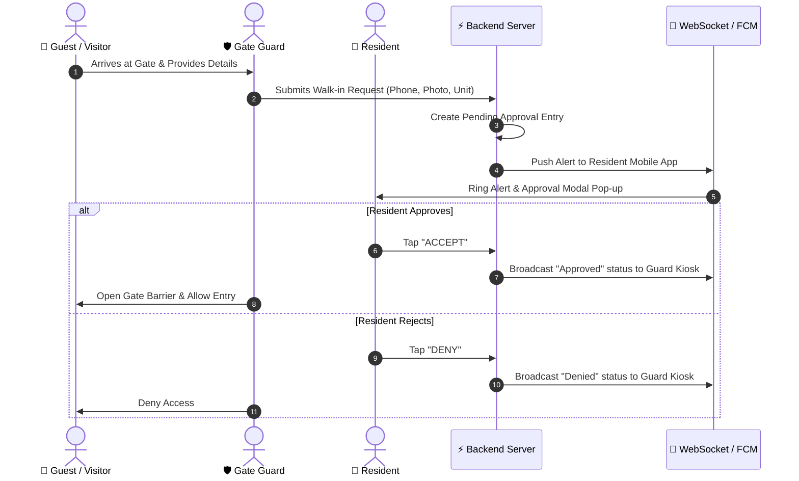
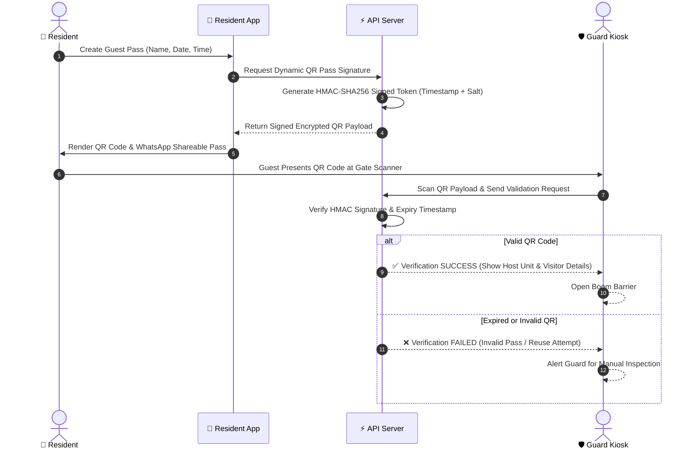

# 🛡️ SecureGate — Next-Gen Apartment & Gated Community Security Ecosystem

> **The All-in-One Enterprise Platform for Smart Access Control, Guard Gatekeeping, Resident Comfort, and Facility Management.**

[](#-platform-ecosystem)
[](#-technology-stack)
[](#-technology-stack)
[](#-key-architectural-highlights)
[](#-security--compliance-architecture)

---

## 🌟 Executive Overview

**SecureGate** is a state-of-the-art, enterprise-grade gated community security and society management ecosystem. Engineered for residential complexes, gated townships, commercial estates, and high-rise apartment societies, SecureGate bridges the gap between gate security personnel, residents, facility managers, and management committees.

By integrating **real-time WebSockets**, **cryptographic dynamic QR verification**, **offline-first guard kiosks**, **ANPR vehicle tracking**, **emergency SOS siren cascades**, and **comprehensive financial & maintenance workflows**, SecureGate provides 360-degree security and seamless modern living.

---

## 📱 Platform Ecosystem

SecureGate is structured into **four interconnected applications** backed by a high-throughput, real-time micro-serviced API backend:



---

## 🚀 Key Feature Catalog

### 1. 🚪 Smart Visitor & Access Control Engine
* **Pre-Approved Guest Passes:** Residents generate instant shareable digital passes with dynamic QR codes for family, friends, and cabs.
* **Dynamic HMAC-SHA256 QR Verification:** Time-sensitive, encrypted QR codes prevent screenshot sharing, pass duplication, or replay attacks.
* **Instant Walk-in Approvals:** Unannounced visitors trigger push notifications and interactive real-time pop-ups on the resident's mobile app with 1-tap Accept/Reject buttons.
* **OTP Verification Engine:** Dynamic 6-digit OTP engine via SMS/App for visitors without smart devices or during app offline states.
* **Delivery & Service Provider Fast-Pass:** Express entry for verified delivery drivers (Amazon, Zomato, Swiggy, FedEx) with host unit notification.
* **Overstay & Unverified Visitor Alerts:** Automated tracking flags visitors who remain inside property premises past expected departure hours.

### 2. 🚨 Emergency SOS & Crisis Response System
* **1-Tap Resident Panic Button:** Instantly triggers high-priority panic alarms from the resident mobile app.
* **Multi-Channel Alert Escalation Cascade:**
  1. Instant siren and visual red flashing alert on the **Manager Command Portal**.
  2. Urgent audio alarm on all **Guard Gatekeeper Kiosks** with unit number and emergency contact info.
  3. Automated push notifications and SMS broadcasts to designated family emergency contacts.
* **Emergency Categories:** Medical Emergency, Fire Hazard, Security Intrusion, Lift Breakdown, or Domestic Disturbance.
* **Incident Resolution Workflow:** Guards and managers can log response timestamps, notes, and mark incidents resolved with full audit tracking.

### 3. 🚗 Smart Parking & ANPR Vehicle Security
* **Resident Vehicle Registry:** Database mapping vehicle plate numbers, 2-wheeler/4-wheeler types, RFID tag IDs, and assigned parking bays.
* **ANPR Camera & RFID Gate Barrier Integration:** Hardware-ready API for Automatic Number Plate Recognition cameras and automated boom barriers for contactless entry.
* **Visitor Parking Manager:** Live tracking of designated visitor parking bays to prevent unauthorized parking in resident slots.
* **Wrongful Parking Flagging:** Residents and guards can report improperly parked vehicles with image uploads and owner notification.

### 4. 🛡️ Guard Operations & Workforce Management
* **Digital Shift Rostering:** Flexible scheduling for morning, evening, and night shifts across multiple gate posts (Main Gate, Service Gate, Tower Lobbies, Clubhouse).
* **Biometric & Geo-Fenced Clock-In:** Verify guard attendance and on-post presence with location validation.
* **Guard Patrol Guarding & Check-Ins:** Scheduled QR-checkpoint patrol routes throughout property grounds with real-time compliance reporting.
* **Leave & Absence Workflow:** Shift handover management and replacement guard assignment to prevent unstaffed security posts.
* **Guard Incident Logging:** Guards capture digital photos, notes, and severity ratings for suspicious activities or property damage.

### 5. 👥 Resident Directory & Household Management
* **Comprehensive Occupancy Master Database:** Filterable directory of all towers, flats, villas, owner vs. tenant occupancy, and contact details.
* **Family & Co-Occupant Management:** Main unit holder can register family members, granting them individual mobile app access.
* **Move-In / Move-Out Digitization:** Seamless onboarding for new residents and offboarding for departing tenants, with automatic revocation of access passes upon move-out.
* **Emergency Contact Vault:** Stored emergency contacts per unit accessible to managers during critical situations.

### 6. 🧹 Daily Staff & Service Worker Management
* **Daily Service Worker Registry:** Directory of maids, cooks, drivers, nanny, gardeners, and maintenance technicians with ID verification documents.
* **Digital Staff Gate Passes:** Daily recurring time-window entry passes for registered staff.
* **Inside Property Status Tracker:** Residents and guards view live status indicating if their maid or driver is currently inside the society grounds.
* **Staff Attendance & Rating:** Automated clock-in/out logs for service workers and resident rating system for community service quality.

### 7. 🔧 Maintenance & Work-Order Ticket Management
* **Digital Complaint Filing:** Residents upload photos, audio notes, and descriptions for plumbing, electrical, carpentry, or common area issues.
* **Work Order Assignment:** Facility managers assign tickets to in-house maintenance personnel or third-party vendors with priority SLAs.
* **Real-time Status Tracking:** Status tracking from *Open* ➔ *In Progress* ➔ *Pending Verification* ➔ *Resolved*.
* **Feedback & Rating System:** Resident sign-off and satisfaction rating before ticket closure.

### 8. 💰 Society Financial Ledger & Dues Management
* **Automated Maintenance Bill Generation:** Periodic maintenance dues calculated based on flat square footage or fixed rates.
* **Integrated Payment Gateway:** Residents pay maintenance bills directly via Credit/Debit Cards, UPI, Net Banking, or Wallet via Razorpay integration.
* **Instant Digital Payment Receipts:** Automated receipt generation and SMS confirmation.
* **Defaulting Unit Tracking & Reminders:** Automatic automated reminders for pending dues and financial transparency reports for committee members.

### 9. 🎉 Amenity & Venue Reservation Engine
* **Clubhouse & Venue Booking:** Residents reserve common amenities like Party Halls, Tennis Courts, Swimming Pools, Barbecue Areas, or Guest Houses.
* **Slots & Capacity Control:** Prevent double-booking with real-time calendar availability and slot duration rules.
* **Amenity Booking Fees & Refundable Deposits:** Payment integration for hall rental charges and security deposits.

### 10. 📢 Digital Community Noticeboard & Broadcasts
* **Targeted Society Announcements:** Managers post notices categorized by General, Emergency, Maintenance, or Events.
* **Push Broadcast Notifications:** Instant app alerts ensuring critical notices reach all residents immediately.
* **Community Polls & Opinion Voting:** Conduct society surveys and digital polls for committee decision-making.

### 11. 📹 CCTV Stream & Smart Hardware Integration
* **Live Camera Stream Integration:** Connect RTSP/WebRTC CCTV feeds directly into the Manager Command Portal.
* **Gate Barrier Triggering:** Digital override buttons for managers and guards to open/close barrier gates remotely.
* **IoT Hardware Ready:** REST/MQTT API endpoints for hardware barrier integration, biometrics, and RFID scanners.

### 12. 📶 Resilient Offline-First Architecture
* **Guard Kiosk Offline Storage:** Guard mobile app operates seamlessly even during network outages using local SQLite storage.
* **Async Action Queue:** Gate entry scans and manual logs captured offline are automatically synced to the server once connectivity is restored.
* **Zero Gate Downtime:** Guarantee 99.99% operational continuity at property entry points.

### 13. 📊 Analytics, PDF Reports & System Audit Logs
* **Executive Metrics Dashboard:** Real-time counters for active guards, visitors inside, today's entry count, and pending approvals.
* **Exportable Audit Reports:** Generate detailed PDF/Excel reports for visitor logs, guard attendance, incident records, and financial ledgers.
* **Immutable System Audit Trail:** Comprehensive activity log tracking every administrative action, gate approval, and security override for compliance.

---

## 📐 Architecture & System Data Flows

### A. Live Walk-in Approval Sequence


### B. Dynamic Cryptographic QR Pass Flow


---

## 🛠️ Technology Stack Breakdown

| Layer | Technologies Used | Key Purpose / Details |
| :--- | :--- | :--- |
| **Manager Web Portal** | React 19, TypeScript, Vite, Iconify, jsPDF, Socket.IO Client | Command center web dashboard for admins & facility managers |
| **Mobile Applications** | React Native, Expo, TypeScript, React Navigation | Native iOS & Android apps for Residents and Gate Guards |
| **Backend API Core** | Node.js, Express, TypeScript, Zod | RESTful API server with strict runtime type validation |
| **Real-Time Layer** | Socket.IO, WebSockets, Redis Pub/Sub | Instant low-latency (<200ms) event notifications & SOS alerts |
| **Database & ORM** | PostgreSQL, Prisma ORM | Relational schema with acid compliance, indexes & migrations |
| **Caching & Queues** | Redis, Bull Queue | Session caching, rate limiting, and async background job handling |
| **Security & Auth** | JWT (HS256), bcryptjs, Speakeasy OTP, Helmet, CORS | Multi-role access control, password hashing & rate limiting |
| **Integrations** | Firebase Admin (FCM), Twilio SMS, Razorpay, PDFKit | Push notifications, SMS OTP, online payments, report PDFs |

---

## 🔒 Security & Compliance Architecture

SecureGate is architected around **Zero-Trust Security Principles** to protect sensitive resident privacy and community data:

1. **Role-Based Access Control (RBAC):**
   * Strict authorization scopes for `RESIDENT`, `GUARD`, `MANAGER`, `COMMITTEE`, and `SUPER_ADMIN`.
   * Enforced at API endpoint middleware level and database query level.
2. **Cryptographic Integrity:**
   * HMAC-SHA256 signature algorithm for all generated QR pass tokens.
   * Speakeasy constant-time TOTP/OTP verification to prevent timing attacks.
3. **Data Protection & Hardening:**
   * Startup env validation via Zod schemas (`src/config/env.ts`).
   * Password hashing via `bcryptjs` (salt rounds = 12).
   * HTTP Security headers via `Helmet`.
   * Rate limiting (`express-rate-limit`) on login and OTP request endpoints to prevent brute-force attacks.
4. **Auditability & Compliance:**
   * Every gate entry, emergency SOS, bill payment, and admin settings change is logged in an immutable audit ledger with user ID, IP address, and timestamp.

---

## 📂 Repository Workspace Structure

```
society-security/
├── apartment-security/            # Monorepo Workspace
│   ├── apps/
│   │   ├── api-server/            # Node.js + Express + Prisma Backend
│   │   │   ├── prisma/            # Database Schema & Migrations
│   │   │   ├── src/
│   │   │   │   ├── controllers/   # API Endpoint Controllers
│   │   │   │   ├── middleware/    # Auth, RBAC, Rate Limiting
│   │   │   │   ├── routes/        # Express Route Registers
│   │   │   │   ├── services/      # Business Logic Services
│   │   │   │   └── websocket/     # Socket.IO Event Handlers
│   │   ├── manager-dashboard/     # Admin Command Center Portal
│   │   ├── resident-app/          # Resident iOS/Android App (Expo)
│   │   ├── guard-app/             # Guard Kiosk & Mobile App (Expo)
│   │   └── committee-portal/      # Governance Portal
│   └── docker-compose.yml         # Container Orchestration
├── manager/                       # Standalone Manager Portal Distribution
│   ├── src/                       # Manager React Source Code
│   └── vite.config.ts             # Vite Configuration
├── backend.md                     # Backend API Specification & Guide
├── security.md                    # Security Audit Checklist & Verification
└── readmebroucher.md              # Project Master Brochure & Feature Guide
```

---

## ⚡ Getting Started & Quick Start Guide

### Prerequisites
* **Node.js**: v18.x or higher
* **Package Manager**: `npm` or `pnpm`
* **Database**: PostgreSQL (v14+)
* **In-Memory Cache**: Redis (v6+)

### 1. Backend Server Setup

```bash
# Navigate to API server directory
cd apartment-security/apps/api-server

# Install dependencies
npm install

# Setup Environment Variables (.env)
cp .env.example .env

# Run Database Migrations & Generate Prisma Client
npx prisma migrate dev
npx prisma generate

# Start API Server in Development Mode
npm run dev
```

### 2. Manager Portal Setup

```bash
# Navigate to Manager Web Directory
cd manager

# Install dependencies
npm install

# Start Vite Development Server
npm run dev
```

### 3. Mobile Apps (Resident & Guard) Setup

```bash
# Navigate to Resident App
cd apartment-security/apps/resident-app
npm install
npx expo start

# Navigate to Guard App
cd apartment-security/apps/guard-app
npm install
npx expo start
```

---

## 🏆 Business Benefits & Value Proposition

| Stakeholder | Key Value Delivered |
| :--- | :--- |
| **🏢 Facility Managers** | Centralized live visibility, instant emergency response, automated billing, zero paper registers, and digital workforce monitoring. |
| **📱 Resident** | Enhanced family safety, 1-tap visitor approvals, convenience, online maintenance payments, and digital amenity bookings. |
| **🛡️ Security Guards** | Fast & easy gatekeeper interface, automated QR scanner, offline resilience, clear duty rosters, and direct SOS escalation. |
| **🏛️ Management Committees** | Complete financial transparency, audit logs, reduced operational overhead, high property value, and resident satisfaction. |

---

<p align="center">
  <b>SecureGate</b> — <i>Redefining Gated Community Security & Property Management.</i><br/>
  © 2026 SecureGate Technologies. All Rights Reserved.
</p>
